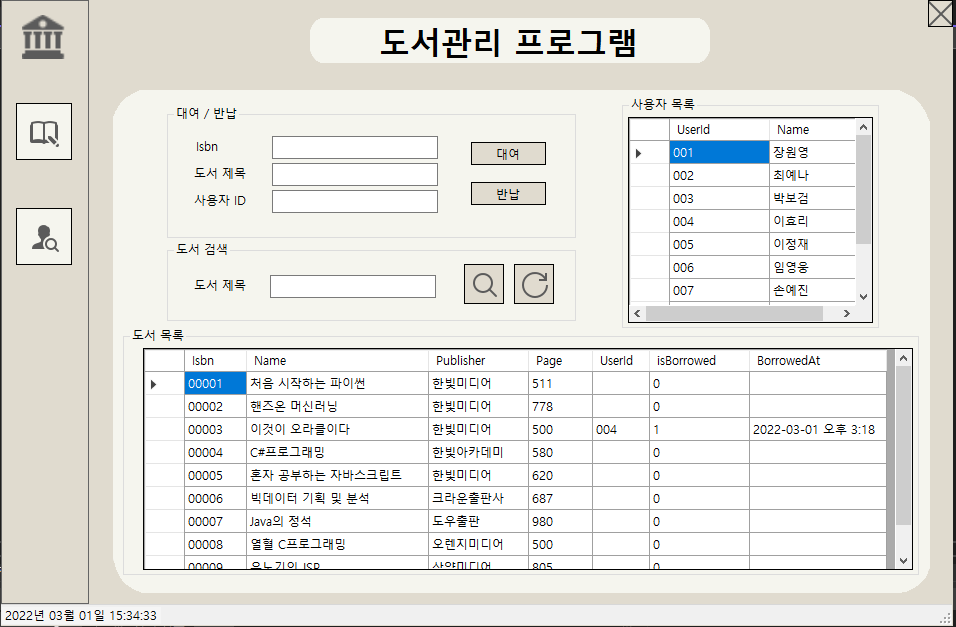
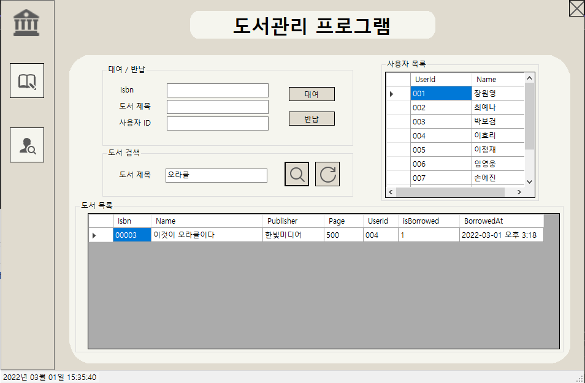
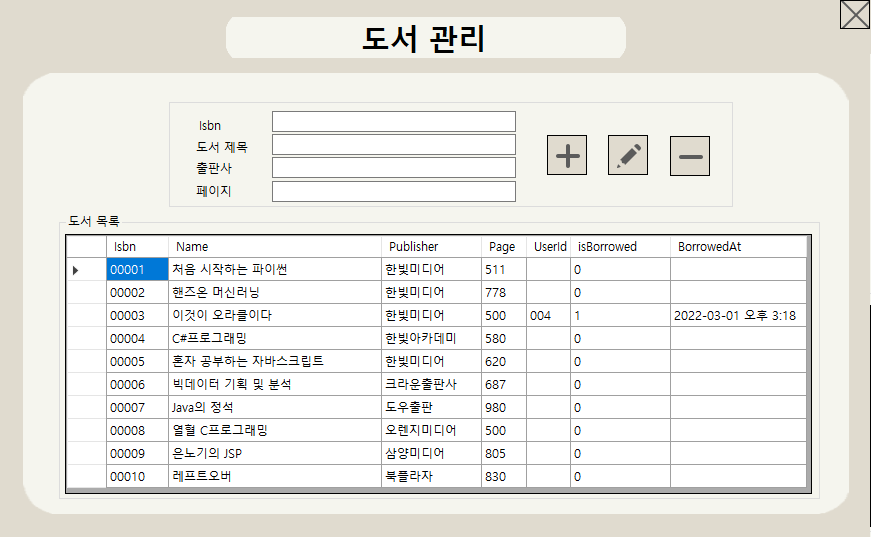
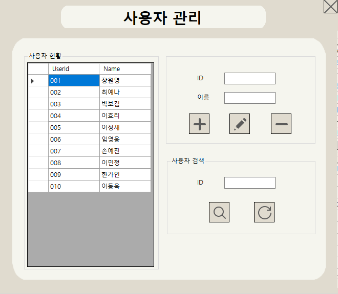
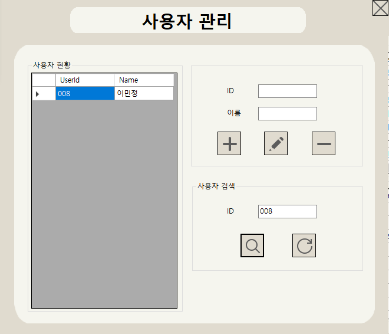

# 📖 C# 도서관리 프로그램
- <b>Language</b> : 
- <b>Database</b> : 
- <b>Tool</b> : 
- 도서관리를 목적으로 하였습니다.

<br>

## 🔖 제작기간 및 개발 인원
- 기간 : 2022.02 ~ 2022.02 (약 1주)
- 인원 : 1명 ( 개인 프로젝트 )

<br>

## 🔖 주요 기능

### 🔸 메인화면
- 전체적인 도서 목록과 사용자 목록을 확인할 수 있습니다.
- <b>대여 / 반납</b> : 대여중인 책은 isBorrowed가 1로 표기되며, 빌려간 시간과 ID가 저장됩니다.
-                     대여하려는 책의 isBorrowed가 1이라면 대여가 불가능합니다.
- <b>도서 검색</b> : 제목을 비교해 정보를 불러옵니다. reset버튼을 누르면 다시 전체목록으로 바뀝니다.
- <b>도서 및 사용자 관리</b> : 프로그램 왼쪽 버튼으로 도서관리와 사용자관리 폼으로 이동됩니다.






<details>
<summary>코드보기</summary>
<div markdown="1">
  
```C#
  
private void button_search_Click(object sender, EventArgs e)
{ 
    bool chkBook = false;
    if (textBox_search.Text.Trim() == "")
        MessageBox.Show("도서 제목을 입력하세요.");
    else
    {
        string[] search_book = textBox_search.Text.Split(' '); //공백기준으로 단어 나눔
        string search_book_Name=search_book[0].Trim(); // 첫번째 단어 공백제거 후 저장

        for(int i=0; i < DataManager.Books.Count; i++)
        {
             if(DataManager.Books[i].Name.Contains(search_book_Name))
             {
                  DataManager.BookSearch(search_book_Name);
                  chkBook = true;
             }
        }
        if (chkBook==false)
        {
             MessageBox.Show("조회된 도서가 없습니다.");
        }
        else
        {
             dataGridView_bookManager.DataSource = null;
             if (DataManager.Books.Count > 0)
                 dataGridView_bookManager.DataSource = DataManager.Books;
        }
    }
}

private void button_reset_Click(object sender, EventArgs e)
{
    ReLoad();
}
private void ReLoad()
{
    DataManager.Load();
    dataGridView_bookManager.DataSource = null;
    if (DataManager.Books.Count > 0)
        dataGridView_bookManager.DataSource = DataManager.Books;

        dataGridView_user.DataSource = null;
    if (DataManager.Users.Count > 0)
         dataGridView_user.DataSource = DataManager.Users;
}
  
```
  
</div>
</details>
  
  <br>
  
### 🔸 도서 관리 화면
- 도서 관리 기능(추가, 수정, 삭제)이 있으며, isbn이 겹치면 등록되지 않습니다. 
- isBorrowed는 DB에서 Default 값으로 0이 자동으로 입력됩니다. 
  

  
  <br>
  
### 🔸 도서 관리 화면
  

  

